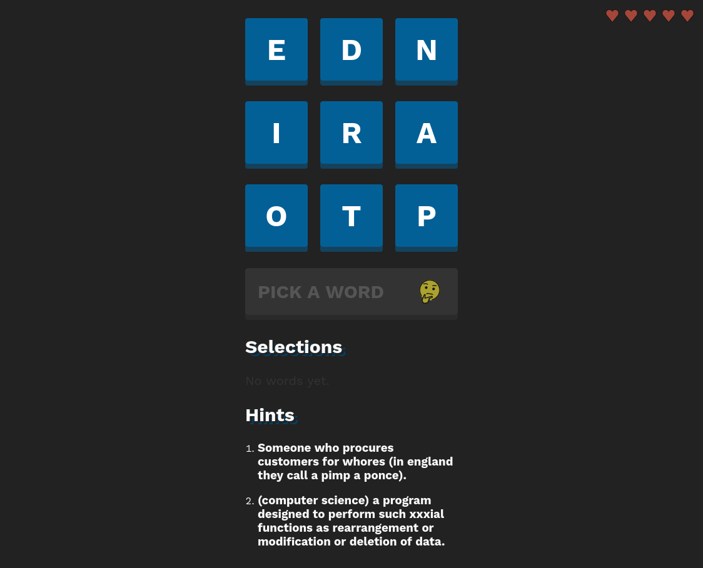

# Word Game

This is just a fun little word game that combines crossword puzzles and a boggle-like board of letters where you have to uncover the solutions.

This uses [WordNet](https://wordnet.princeton.edu/) under the hood to get definitions of words as hints.

